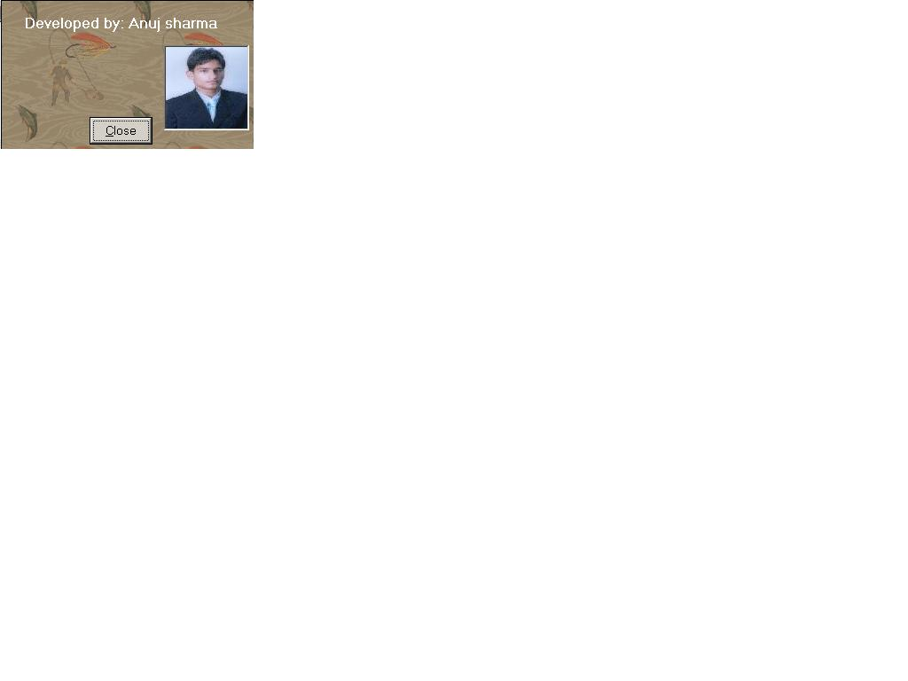



## Norton Pop\-up Window

### Description

This is like as nortan antivirus message window. A pop-up window appears just like as nortan or Msn-Messanger.A very amazing code which helps u to understand calling api's. Convert twips to pixels, and many more.
 
### More Info
 
Knowleadge of Windows api. and conversion of twips and pixels.

             |
---                |---
**Submitted On**   |2004-05-06 17:34:12
**By**             |[Anuj sharrma](https://github.com/Planet-Source-Code/PSCIndex/blob/master/ByAuthor/anuj-sharrma.md)
**Level**          |Advanced
**User Rating**    |4.5 (27 globes from 6 users)
**Compatibility**  |VB 5\.0, VB 6\.0
**Category**       |[Windows API Call/ Explanation](https://github.com/Planet-Source-Code/PSCIndex/blob/master/ByCategory/windows-api-call-explanation__1-39.md)
**World**          |[Visual Basic](https://github.com/Planet-Source-Code/PSCIndex/blob/master/ByWorld/visual-basic.md)
**Archive File**   |[Nortan\_Pop174212562004\.zip](https://github.com/Planet-Source-Code/anuj-sharrma-norton-pop-up-window__1-53610/archive/master.zip)

